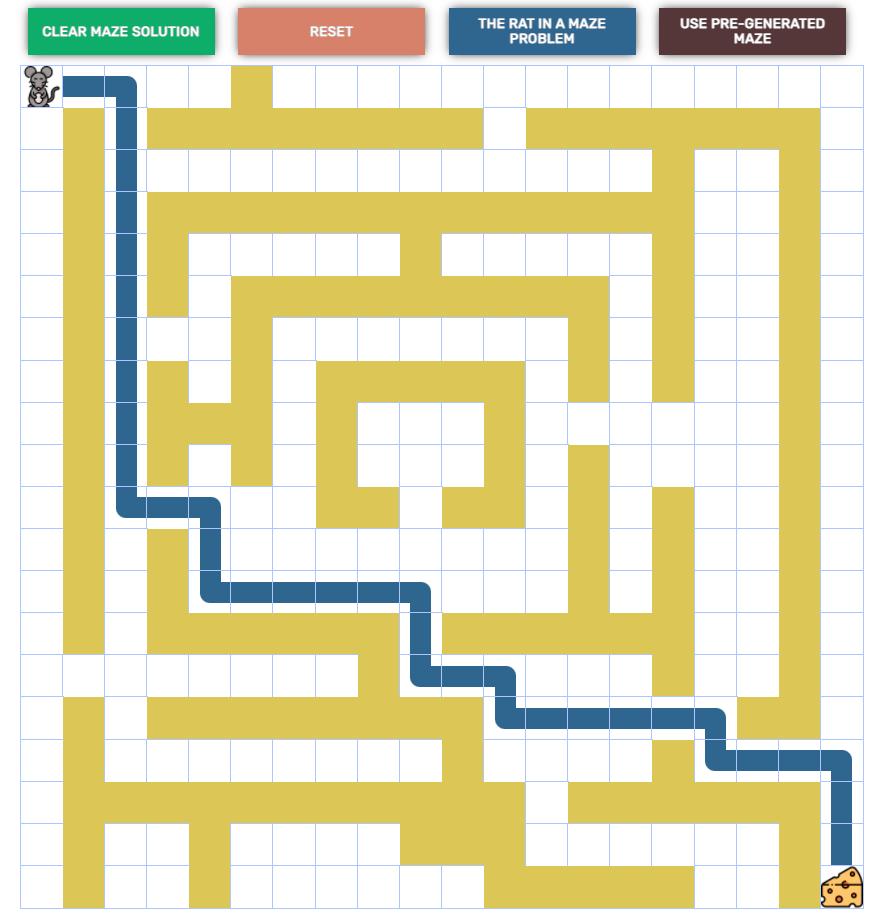

<h1 align="center">Welcome to Rat In a Maze 👋</h1>
<p>
  
</p>

## Description
<ul>
  <li>This project is a visualization of the Rat in a Maze problem using React.</li>
  <li>I wrote this project in a mixture of JavaScript and TypeScript (I'm still learning TypeScript). I plan to get to a point where future projects will be completely TypeScript.</li>
  <li>I experimented with using the Context API and useReducer hook for state management.</li>
</ul>

<p align="center">

</p>

### 🏠 [Demo](http://jersoroka.github.io/rat-in-a-maze-react)

## Install

```sh
yarn install
```

## Usage

```sh
yarn run start
```

## Run tests

```sh
yarn run test
```

## Author

👤 **Jeremy Soroka**

* Github: [@jersoroka](https://github.com/jersoroka)

## Show your support

Give a ⭐️ if this project helped you!

***
<div>Icons made by <a href="https://www.freepik.com" title="Freepik">Freepik</a> from <a href="https://www.flaticon.com/" title="Flaticon">www.flaticon.com</a></div>
_This README was generated with ❤️ by [readme-md-generator](https://github.com/kefranabg/readme-md-generator)_
